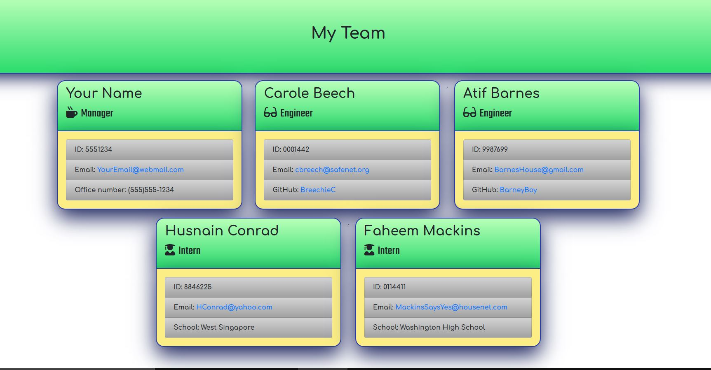

# Employee Manager CLI
      


## Concepts within

- Javascript Classes
- npm inquirer
- 

## Getting Started

This is the official EMPLOYEE MANAGER CLI for use to draft Development Teams quickly and generate a Website of it's roster.

## Installation

To set up run these commands: 

```=======

# Employee Manager CLI
      


## Getting Started

This is the official EMPLOYEE MANAGER CLI for use to draft Development Teams quickly and generate a Website of it's roster.

## Installation

To set up run these commands: 

```
git clone https://github.com/JMantis0/Employee-Manager-CLI project
cd project
npm install
```

Then run `node app.js` to run the program.  Begin drafting your Developemt team; a prompt will appear on your command line.

## Usage

Enter Manager details and then add more employees to the Roster.  The team's HTML page is saved in the output folder when you are done adding employees.




## Contributing

Feel free to leave issues on repo

## License

## Concepts with-in:

OBJECTS, Inquirer.  Also see 


Copyright (c) 2020 Jesse Mazur

Permission is hereby granted, free of charge, to any person obtaining a copy
of this software and associated documentation files (the "Software"), to deal
in the Software without restriction, including without limitation the rights
to use, copy, modify, merge, publish, distribute, sublicense, and/or sell
copies of the Software, and to permit persons to whom the Software is
furnished to do so, subject to the following conditions:

The above copyright notice and this permission notice shall be included in all
copies or substantial portions of the Software.

THE SOFTWARE IS PROVIDED "AS IS", WITHOUT WARRANTY OF ANY KIND, EXPRESS OR
IMPLIED, INCLUDING BUT NOT LIMITED TO THE WARRANTIES OF MERCHANTABILITY,
FITNESS FOR A PARTICULAR PURPOSE AND NONINFRINGEMENT. IN NO EVENT SHALL THE
AUTHORS OR COPYRIGHT HOLDERS BE LIABLE FOR ANY CLAIM, DAMAGES OR OTHER
LIABILITY, WHETHER IN AN ACTION OF CONTRACT, TORT OR OTHERWISE, ARISING FROM,
OUT OF OR IN CONNECTION WITH THE SOFTWARE OR THE USE OR OTHER DEALINGS IN THE
SOFTWARE.
